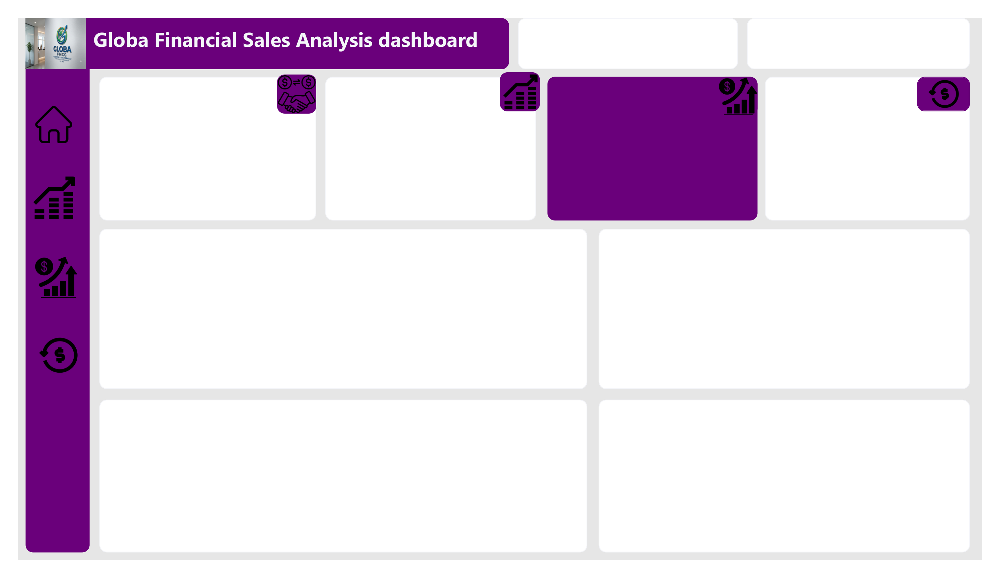

# Globa Financial Sales Analysis Dashboard

## Overview
This project analyzes global financial sales performance across countries, customer segments, and time, using Power BI. It's a full rebuild of an earlier version of this dashboard this time built on a proper data model instead of a single flat table, making the numbers more accurate and the report far easier to extend.

## Business Problem
The original version of this dashboard was built on a single flat table with no real data model behind it. It looked fine on the surface, but the numbers weren't fully reliable, and adding new measures kept introducing errors. The goal of this rebuild was to answer:
Which countries and segments are driving the most revenue?
How does performance compare year-over-year (2013 vs 2014)?
Which products contribute the most to revenue and profit?
Is the business's profit margin healthy across the board?

## Data Source
Financial sales transaction data covering multiple countries, customer segments, and products across 2013–2014.

## Tools & Skills Used
**Power BI Desktop**- data modeling and dashboard build
**Power Query**- data cleaning and transformation
**DAX**- measures and calculated columns
**Star Schema data modeling**

## Project Process

**1. Data Cleaning**
Cleaned the raw data in Power Query Where I fixed data types, removed duplicates, standardized text fields, and handled blanks before any modeling began.
.png)

**2. Data Modeling (Star Schema)**
Rebuilt the data model from a single flat table into a proper Star Schema With one Fact table connected to Date, Country, Segment, and Product dimension tables.
.png)

**3. Wireframe**
Sketched out the full dashboard layout before building a single visual, to plan where KPIs, filters, and charts should sit for the end user.

**4. Dashboard Build**
Built out the final dashboard using the cleaned, modeled data , KPI cards, trend charts, and breakdowns by country, segment, and product.

## Key Insights
**$119M** in total revenue across **700** transactions, at a **14% profit margin**
Revenue from the **US, Canada, France, and Germany** sits within $1M of each other ($24M–$25M each)  no single dominant market
**Government** is the top-performing segment at **$53M**, roughly 25% ahead of Small Business ($42M)
**2014 revenue spiked sharply in October** before dipping and rebounding again by December
**Paseo** is the top product by revenue ($33M), followed by VTT ($21M) and Velo ($18M)
Profit margins across products range from **13%–16%**, showing fairly consistent profitability rather than one standout or one underperformer

## Dashboard Features
KPI cards with sparklines: Total Transactions, Total Revenue, Profit, Profit Margin
Total Revenue by Month Name and Year (2013 vs 2014 comparison)
Total Revenue by Country
Total Revenue by Segment
Product-level breakdown table (Transactions, Revenue, Profit, Profit Margin)
Country and Segment slicers for interactive filtering

## Recommendations
Since revenue is fairly evenly spread across the top 4 countries, growth strategies should be tested across all of them rather than concentrated on a single "leading" market
Government's strong lead in revenue makes it worth investigating what's driving that segment's performance, to see if similar tactics apply elsewhere
The October 2014 spike is worth a deeper root-cause look (promotion, seasonal demand, or a one-off large order) before assuming it will repeat

## Limitations
Profit figures are based on the data as provided; no external cost validation was performed
The dataset covers only 2013–2014, so longer-term trend analysis isn't possible with this data alone

## Files
`Globa Financial Analysis Dashboard.pbix` - the full Power BI project file
Screenshot (288).png - cleaned data screenshot
Screenshot (291).png - Star Schema screenshot
WireFrame.png - wireframe screenshot
Globa Financial Analysis Dashboa_202607300006_1.png - final dashboard screenshot

## How to Use This File
Requirements: Power BI Desktop installed (free download from Microsoft) -this file will not open in Power BI Service or a browser without it.

Steps to open the dashboard:
Download `Globa Financial Analysis Dashboard.pbix` from this repo (click the file, then the download icon, or use "Add file → this file" via the raw link)
Open Power BI Desktop on your computer
Go to File → Open Report, then select the downloaded `.pbix` file
The report will open with all pages, visuals, and the data model intact

Steps to explore the data model:
Once open, click "Model view" on the left-hand side of Power BI Desktop to see the Star Schema , the Fact table and its relationships to the Date, Country, Segment, and Product dimension tables

Steps to view or edit the DAX measures:
Click the "Data" or "Model" view, then look in the Fields pane on the right for the measures listed under the fact table — click any measure to see its DAX formula in the formula bar

Steps to interact with the dashboard:
On Page 1, use the Country and Segment slicers at the top to filter the whole page
Hover over any chart to see tooltips with exact values
Click a bar, segment, or country to cross-filter the rest of the visuals on the page

Note: if any visuals appear blank or show an error when the file is first opened, it's usually because Power BI is trying to refresh a data source it can't find on your machine — right-click the affected visual or check Transform Data → Data Source Settings to reconnect if needed.

## Connect With Me
Portfolio: komobolaji20-droid.github.io

GitHub: github.com/komobolaji20-droid

Email: Komobolaji20@gmail.com

WhatsApp: 09135972094
